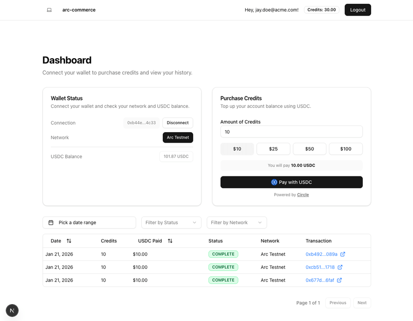

# ChartsonBase

AI-powered technical chart analysis with USDC subscription payments on **Base Sepolia** testnet. Built with Node.js + Express, Circle Developer Controlled Wallets, and Gemini AI. Also ships an **MCP server** for AI agent integration.



## Features

- 📈 **Live charts** via Binance API (crypto) with mock fallback (stocks, forex, commodities)
- 🤖 **AI chart analysis** — Gemini Vision or heuristic engine for pattern detection, Entry / SL / TP
- 💰 **USDC payments** — ERC-20 transfer on Base Sepolia to unlock chart subscription plans
- 🔑 **EIP-712 session auth** — wallet-signed authentication without a backend login
- 🔗 **MCP server** — `list_pairs`, `get_pair_price`, `analyze_chart` tools for AI agents
- 🌐 **Base Sepolia** — chain ID `84532`, USDC `0x036CbD53842c5426634e7929541eC2318f3dCF7e`

---

## Prerequisites

- **Node.js v22+** — install via [nvm](https://github.com/nvm-sh/nvm)
- **Circle Developer Account** — [console.circle.com](https://console.circle.com/signin) (API key + entity secret)
- **Google Gemini API key** — [aistudio.google.com](https://aistudio.google.com/app/apikey) *(optional — heuristic fallback works without it)*
- **MetaMask / Coinbase Wallet** — connected to Base Sepolia testnet
- **Base Sepolia ETH** — for gas: [faucet.quicknode.com/base/sepolia](https://faucet.quicknode.com/base/sepolia)
- **Base Sepolia USDC** — [faucet.circle.com](https://faucet.circle.com)

---

## Getting Started

### 1. Clone & Install

```bash
git clone <your-repo-url>
cd chartsonbase
npm install
```

### 2. Configure Environment

```bash
cp .env.example .env
```

Edit `.env` and fill in your credentials (see [Environment Variables](#environment-variables) below).

### 3. Run the App

```bash
npm start
# → http://localhost:3000
```

---

## Network & Contract Addresses (Base Sepolia)

| Item | Value |
|------|-------|
| Chain ID | `84532` (0x14a34) |
| RPC URL | `https://sepolia.base.org` |
| Block Explorer | `https://sepolia.basescan.org` |
| USDC Contract | `0x036CbD53842c5426634e7929541eC2318f3dCF7e` |
| Circle USDC Token ID | `5a64c456-03f7-5238-a77a-a780b0b90263` |
| Base App ID | `6a39565605a5b1b83fb2250f` |

---

## Subscription Plans

| Plan | Price | Pairs |
|------|-------|-------|
| Starter | 3 USDC | 5 pairs |
| Pro | 5 USDC | 10 pairs |
| Elite | 15 USDC | 35 pairs |

---

## MCP Server (AI Agent Integration)

The MCP server exposes 3 tools for AI agents (Claude Desktop, Cursor, etc.):

```bash
node mcp-server.js
```

**Claude Desktop config** (`claude_desktop_config.json`):
```json
{
  "mcpServers": {
    "chartsonbase": {
      "command": "node",
      "args": ["/path/to/chartsonbase/mcp-server.js"]
    }
  }
}
```

**Available tools:**
| Tool | Description |
|------|-------------|
| `list_pairs` | List all supported assets (45+ crypto, stocks, forex, commodities) |
| `get_pair_price` | Get live price for any supported symbol |
| `analyze_chart` | Full AI technical analysis with entry, SL, TP, RSI, MACD |

---

## Environment Variables

Copy `.env.example` → `.env` and fill in:

| Variable | Purpose |
|----------|---------|
| `PORT` | Server port (default `3000`) |
| `CIRCLE_API_KEY` | Circle Developer API key |
| `CIRCLE_WALLET_ID` | Your Circle developer-controlled wallet ID |
| `CIRCLE_DESTINATION_WALLET_ID` | Merchant wallet address on Base Sepolia |
| `CIRCLE_ENTITY_SECRET` | Circle entity secret (hex) |
| `CIRCLE_USDC_TOKEN_ID` | USDC token ID on Base Sepolia sandbox |
| `GEMINI_API_KEY` | Google Gemini API key for AI chart analysis |

---

## How It Works

1. **Connect Wallet** — MetaMask / Coinbase Wallet switches to Base Sepolia
2. **Sign EIP-712** — wallet signature authenticates your session (no backend login)
3. **Choose a Plan** — Starter / Pro / Elite with USDC payment
4. **Pay with USDC** — ERC-20 transfer directly on Base Sepolia (or simulated via Circle API)
5. **Unlock Charts** — quota-gated access to live pair data + AI analysis
6. **AI Analysis** — Gemini Vision reads candle data → returns signal, pattern, entry/SL/TP

---

## Security & Usage Model

- Designed for Base Sepolia **testnet** use
- All secrets handled via environment variables
- Not intended for production without further security review

See `SECURITY.md` for vulnerability reporting guidelines.
